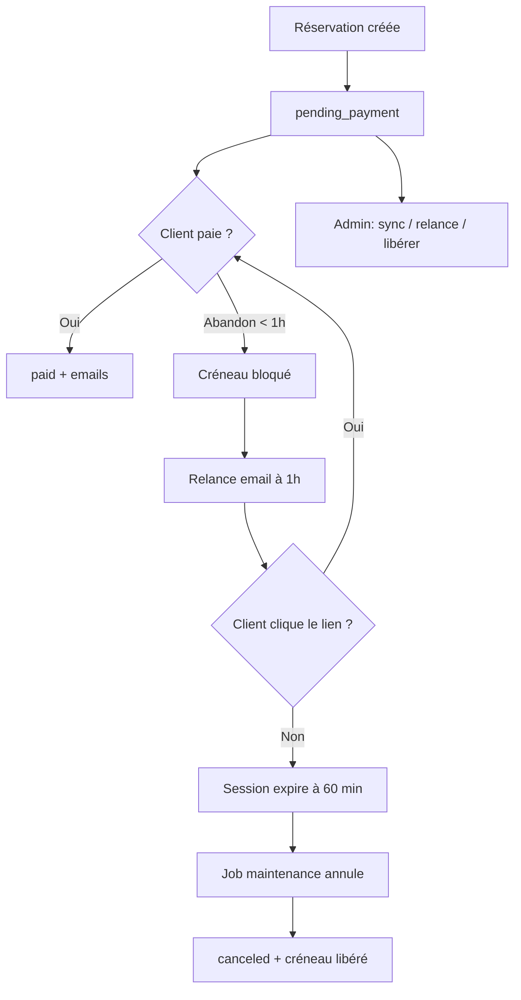

# Herve 2

A Rails 8.1 application with PostgreSQL, Tailwind CSS, and importmap, running entirely in Docker containers.
Helps user buy a car without pain

## Gestion des paiements en attente (`pending_payment`)

Une réservation passe en `pending_payment` dès que le client valide le formulaire, avant la confirmation Stripe. Le créneau est bloqué tant que le paiement n'est pas finalisé ou que la session n'a pas expiré.

### Flux



### Mécanismes automatiques

- **Sessions Stripe** : expiration après 60 minutes (`expires_at`)
- **Relance client** : email automatique 1 h après la création, avec lien sécurisé `/paiement/reprendre/:token` (valable 7 jours)
- **Job récurrent** (`PendingPaymentMaintenanceJob`, toutes les 15 min) :
  - confirme les réservations payées non synchronisées
  - annule les sessions expirées et libère les créneaux
  - notifie l'admin quand des créneaux sont libérés

### Actions admin

Sur la fiche d'une réservation **En attente de paiement**, trois actions sont disponibles.

#### Synchroniser avec Stripe

Interroge Stripe pour connaître l'état réel de la session de paiement, puis met à jour la réservation en conséquence. À utiliser quand l'application et Stripe ne sont plus d'accord.

**Cas typique — paiement orphelin** : le client a bien payé sur Stripe, mais la réservation est restée en attente chez nous. Cela arrive si le webhook Stripe n'a pas été reçu (panne réseau, mauvaise configuration, déploiement en cours) ou si la page de confirmation n'a pas pu finaliser la transaction.

Dans ce cas, le bouton détecte le paiement côté Stripe et passe la réservation en **Payée** (emails de confirmation envoyés automatiquement).

**Autre cas — session expirée** : le client n'a jamais payé et la session Stripe a expiré (après 60 min). Le bouton annule la réservation et **libère le créneau**.

**Si rien ne change** : Stripe indique que le paiement est toujours en cours (session ouverte, non payée). Aucune action nécessaire — attendre ou utiliser « Renvoyer le lien de paiement ».

> Action ciblée : **une seule réservation** à la fois, depuis l'interface admin.

#### Renvoyer le lien de paiement

Envoie immédiatement un email au client avec un lien sécurisé pour reprendre le paiement, sans ressaisir le formulaire. Utile si le client a abandonné, n'a pas reçu la relance automatique, ou demande de l'aide.

#### Libérer le créneau

Annule manuellement la réservation et rend le créneau disponible pour d'autres clients. À utiliser quand on sait que le client ne finalisera pas (erreur, doublon, changement de planning), sans attendre l'expiration automatique.

Le dashboard et la liste des réservations incluent un filtre **En attente de paiement** pour repérer rapidement ces cas.

### Maintenance automatique vs commande manuelle

En production, un job tourne **toutes les 15 minutes** (`PendingPaymentMaintenanceJob` via Solid Queue) et effectue la même logique de synchronisation sur **toutes** les réservations en attente, plus l'envoi des relances email (1 h après la création). L'admin reçoit un email quand des créneaux sont libérés automatiquement.

La commande ci-dessous est l'équivalent **manuel** de ce job — utile en local, en secours si le worker ne tourne pas, ou après un incident :

```
docker-compose run web rails bookings:maintain_pending_payments
```

Elle affiche un résumé :

```
Confirmées : 1    ← paiements orphelins rattrapés
Annulées   : 2    ← sessions expirées, créneaux libérés
Inchangées : 0    ← toujours en attente de paiement
Relances envoyées : 1
```

| | Bouton admin « Synchroniser » | `rails bookings:maintain_pending_payments` |
|---|---|---|
| **Portée** | Une réservation choisie | Toutes les réservations en attente |
| **Relances email** | Non (bouton séparé « Renvoyer le lien ») | Oui, pour les réservations éligibles |
| **Quand l'utiliser** | Un cas précis repéré en admin | Maintenance globale, test local, rattrapage après incident |

# Local Development

## Setup

The project has been dockerized. This means you need to have Docker up and running on your machine to start the project.

> [!NOTE]  
> Please note that the dockerfile used by docker compose is `Dockerfile.dev`
> `Dockerfile` should be used for production

Copy the environment file and set the database variables (same values as in signaux-faibles-v2):

```
cp .env.example .env
```

```
DATABASE_HOST=db
DATABASE_PORT=5432
DATABASE_NAME=herve_2
DATABASE_USERNAME=postgres
DATABASE_PASSWORD=password
```

First create start the `db` service by running

```
docker-compose up -d db
```

then

```
docker-compose run web rails db:create db:migrate
```

This will create the database and run the migrations. For your information, the database is a PostgreSQL database and we use the default configuration for the database connection (host: db, username: postgres, password: password).

Finally start the application by running

```
docker-compose up --build
```

If the application still takes a long time to start, or if it fails, check the container logs for any error messages:

```
docker-compose logs web
```

If you want to connect a dbms to the local dockerized databases, then use the following connection details :

```
Host: localhost
Port: 5433
Database: herve_2_development
Username: postgres
Password: password
```

The application is available at http://localhost:3001

## Common Commands

### Run Rails console

```
docker-compose run web rails console
```

### Run database migrations

```
docker-compose run web rails db:migrate
```

### Run tests

```
docker-compose run web rails test
```

### Stop containers

```
docker-compose down
```

### View logs

```
docker-compose logs -f web
```

## Scalingo (staging / production)

See [Solid Queue on Scalingo](https://doc.scalingo.com/languages/ruby/rails/solid-queue).

1. Attach a PostgreSQL add-on so `DATABASE_URL` is set automatically.
2. Set connection limits (recommended on Starter 512M / low connection plans):

```
scalingo --app herve-2-staging env-set RAILS_MAX_THREADS=3 SOLID_QUEUE_THREADS=2
```

3. Deploy via git push; `postdeploy` runs `rails db:prepare` (primary and queue schemas).
4. Scale the worker so background jobs run:

```
scalingo --app herve-2-staging scale worker:1
```

The `web` container only runs Puma. Solid Queue runs in the `worker` container (`bin/jobs`), not inside Puma.

### Deploy fails with "remaining connection slots are reserved"

Scalingo starts new containers before running `postdeploy`, while old ones are still running. On small PostgreSQL plans (~30 connections), that temporarily doubles connection usage.

If deploys still fail after lowering pool sizes:

```
scalingo --app herve-2-staging scale worker:0
git push scalingo main
scalingo --app herve-2-staging scale worker:1
```

Or upgrade the PostgreSQL add-on for more connections. Check usage in the database dashboard (`current_connections` vs `max_connections`).
